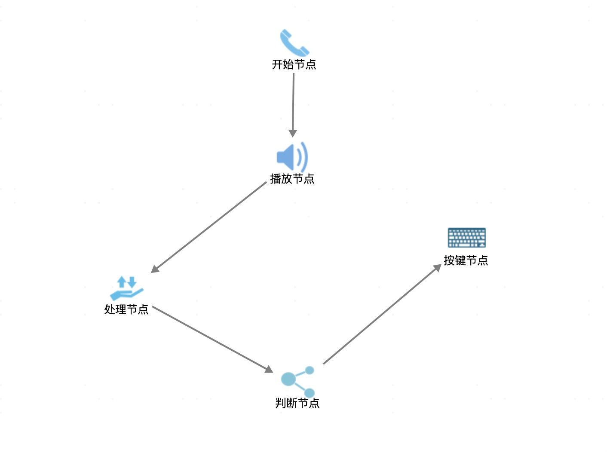

# Flow Control Design

A flow Control designed for IVR flow

# import
```xml
<?xml version="1.0" encoding="UTF-8"?>

<Flow id="1" name="开始节点" neVoicePath="/zben/IVR/Cvoice/nepali/" enVoicePath="/zben/IVR/Cvoice/english/" location="x:804,y:79,width:50,height:50">
    <Play id="2" name="播放节点" remark="" breakFlag="1">
        <Location>x:802,y:212,width:50,height:50</Location>
        <Languages>
            <Language type="1"><![CDATA[]]></Language>
            <Language type="2"><![CDATA[]]></Language>
        </Languages>
    </Play>
    <Service id="3" name="处理节点" remark="" className="java实现类">
        <Location>x:609,y:364,width:50,height:50</Location>
        <Rules>
            <Rule type="0" fromNodeId="2"><![CDATA[4]]></Rule>
        </Rules>
    </Service>
    <Judge id="4" name="判断节点" remark="">
        <Location>x:808,y:473,width:50,height:50</Location>
    </Judge>
    <TouchKey id="5" name="按键节点" remark="" timeOut="10" finishkey="" repeatCount="3" length="1" className="">
        <Location>x:1004,y:307,width:50,height:50</Location>
    </TouchKey>
    <Relations>
        <Relation nodeId="1" childNodeId="2"/>
        <Relation nodeId="2" childNodeId="3"/>
        <Relation nodeId="3" childNodeId="4"/>
        <Relation nodeId="4" childNodeId="5"/>
    </Relations>
</Flow>
```


# export
click export when you complete the flow

# license

This Flow developed based on myflow
